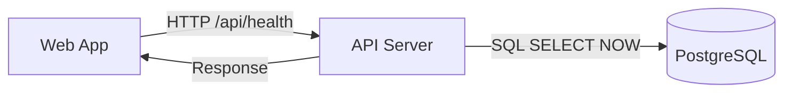
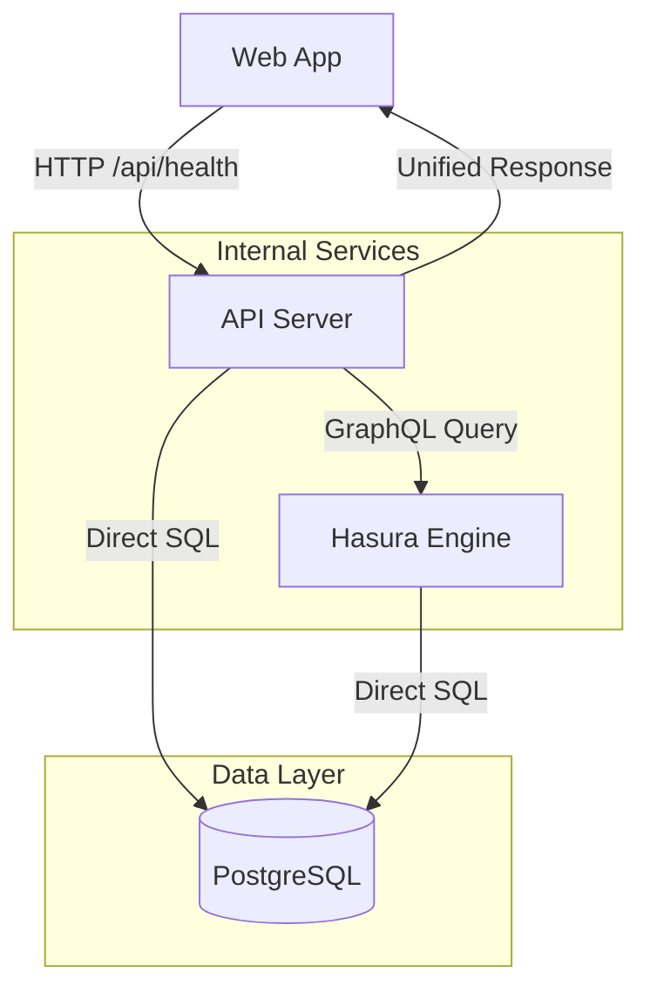

# Hasura Health Check Integration Plan <!-- omit from toc -->

- [AI Process](#ai-process)
  - [Session Continuation Prompt](#session-continuation-prompt)
- [Overview](#overview)
- [Current Architecture](#current-architecture)
- [Proposed Architecture (Option A: API Gateway Pattern)](#proposed-architecture-option-a-api-gateway-pattern)
- [Benefits of API Gateway Pattern](#benefits-of-api-gateway-pattern)
  - [Single Integration Point](#single-integration-point)
  - [Server-Side Orchestration](#server-side-orchestration)
  - [Better Security](#better-security)
- [Database Schema Changes](#database-schema-changes)
  - [New Tables](#new-tables)
- [Hasura Configuration](#hasura-configuration)
  - [Service Definition (render.yaml)](#service-definition-renderyaml)
  - [API Integration](#api-integration)
- [Implementation Tasks](#implementation-tasks)
  - [Database Setup](#database-setup)
  - [Hasura Configuration](#hasura-configuration-1)
  - [API Dependencies](#api-dependencies)
  - [Health Check Enhancement](#health-check-enhancement)
  - [Response Type Updates](#response-type-updates)
  - [Frontend Updates](#frontend-updates)
  - [Deployment Integration](#deployment-integration)
  - [Testing \& Validation](#testing--validation)
- [Enhanced Health Response Format](#enhanced-health-response-format)
- [Risk Mitigation](#risk-mitigation)
  - [Fallback Strategy](#fallback-strategy)
  - [Performance Considerations](#performance-considerations)
- [Success Metrics](#success-metrics)
- [Files to Create/Modify](#files-to-createmodify)
  - [New Files](#new-files)
  - [Modified Files](#modified-files)

## AI Process

This plan follows a structured AI-assisted development process:

1. **Pick Next Task**: Review the Implementation Tasks section below and select the highest priority uncompleted task
2. **Ask Clarifying Questions**: Before coding, ask the developer if any requirements or constraints need clarification
3. **Start Coding**: Implement the selected task following the specifications in this plan
4. **Ask Developer to Test**: Once implementation is complete, prompt the developer to test the functionality
5. **Update Task List**: After developer verification, mark the task as complete in the Implementation Tasks section
6. **Commit Changes**: Create a meaningful commit with the completed work
7. **Continue Work Prompt**: After each session, provide a prompt for continuing work in a new session that references this plan document

### Session Continuation Prompt

```
Continue implementing the Hasura Health Check Integration Plan. Please review docs/plans/hasura-health-check-integration.md and pick the next uncompleted task from the Implementation Tasks section. Follow the AI Process outlined at the top of the document.

Progress completed this session:
- ✅ Health Check Enhancement (Hasura client created, enhanced health check endpoint)
- ✅ Response Type Updates (Enhanced health response interface with version metadata)

Next uncompleted task: Frontend Updates - Update health status component to display version information.
```

## Overview

This plan outlines the integration of Hasura GraphQL engine to enhance our existing health check system with real-time version tracking and deployment metadata. We'll implement an API Gateway pattern where the web app maintains a single integration point with our API, while the API orchestrates data from both direct database queries and Hasura GraphQL.

## Current Architecture



**Current Health Check Flow:**

1. Web app calls `/api/health` endpoint
2. API server checks database connection with `SELECT NOW()`
3. Returns aggregated status with version info from package.json
4. Web component displays status with 30-second polling

## Proposed Architecture (Option A: API Gateway Pattern)



**Enhanced Health Check Flow:**

1. **Unified Gateway Flow**:

   - Web app → API Server (single endpoint: `/api/health`)
   - API Server handles both:
     - Direct database connection tests
     - GraphQL queries to Hasura for version/metadata
   - API combines and returns unified response

2. **Internal Data Sources**:
   - API → Direct PostgreSQL (connection testing, basic queries)
   - API → Hasura GraphQL (version metadata, historical data)
   - API orchestrates and caches responses

## Benefits of API Gateway Pattern

### Single Integration Point

- Web app only needs HTTP client (no GraphQL client)
- Consistent authentication and error handling
- Simplified client-side logic

### Server-Side Orchestration

- API can cache Hasura responses
- Combine data from multiple sources
- Handle fallbacks if Hasura is unavailable

### Better Security

- All external requests flow through API middleware
- Hasura can be internal-only (no public access)
- Centralized rate limiting and monitoring

## Database Schema Changes

### New Tables

```sql
-- Application metadata and version tracking
CREATE TABLE app_metadata (
  id SERIAL PRIMARY KEY,
  component VARCHAR(50) NOT NULL,  -- 'api', 'web', 'hasura'
  version VARCHAR(20) NOT NULL,
  deployed_at TIMESTAMP DEFAULT NOW(),
  git_commit VARCHAR(40),
  environment VARCHAR(20) DEFAULT 'production',
  metadata JSONB,  -- Additional deployment info
  UNIQUE(component, environment)
);

-- Health check snapshots for historical analysis
CREATE TABLE health_snapshots (
  id SERIAL PRIMARY KEY,
  timestamp TIMESTAMP DEFAULT NOW(),
  overall_status VARCHAR(10) NOT NULL,  -- 'up', 'down', 'degraded'
  component_statuses JSONB NOT NULL,    -- {'api': 'up', 'database': 'up', 'web': 'up'}
  response_times JSONB,                 -- {'api': 123, 'database': 45}
  errors JSONB                          -- Error details if any
);

-- Initial data
INSERT INTO app_metadata (component, version, git_commit, environment) VALUES
('api', '1.0.0', 'initial', 'production'),
('web', '1.0.0', 'initial', 'production'),
('hasura', '2.0.0', 'initial', 'production');
```

## Hasura Configuration

### Service Definition (render.yaml)

```yaml
- type: web
  name: hasura
  env: docker
  dockerfilePath: ./Dockerfile.hasura
  region: ohio
  plan: free
  port: 8080
  envVars:
    - key: HASURA_GRAPHQL_DATABASE_URL
      fromService:
        type: pserv
        name: app-postgres
        property: connectionString
    - key: HASURA_GRAPHQL_ENABLE_CONSOLE
      value: "false" # Disable public console
    - key: HASURA_GRAPHQL_ADMIN_SECRET
      sync: false
    # No unauthorized role - internal access only
```

### API Integration

```typescript
// New GraphQL client for API server
import { GraphQLClient } from "graphql-request";

const hasuraClient = new GraphQLClient(
  process.env.HASURA_URL || "http://hasura:8080/v1/graphql",
  {
    headers: {
      "x-hasura-admin-secret": process.env.HASURA_ADMIN_SECRET,
    },
  }
);

// Enhanced health check endpoint
export async function getHealthStatus() {
  // 1. Direct database check (existing)
  const dbStatus = await checkDbConnection();

  // 2. Query version metadata from Hasura
  const versionData = await hasuraClient.request(
    `
    query GetVersions($env: String!) {
      app_metadata(where: {environment: {_eq: $env}}) {
        component
        version
        deployed_at
        git_commit
      }
    }
  `,
    { env: process.env.NODE_ENV || "production" }
  );

  // 3. Optional: Record health snapshot
  await hasuraClient.request(
    `
    mutation RecordHealthSnapshot($snapshot: health_snapshots_insert_input!) {
      insert_health_snapshots_one(object: $snapshot) {
        id
      }
    }
  `,
    {
      snapshot: {
        overall_status: dbStatus.status === "up" ? "up" : "down",
        component_statuses: { database: dbStatus.status, api: "up" },
        response_times: { database: dbStatus.responseTime },
      },
    }
  );

  return {
    status: dbStatus.status,
    // ... existing fields
    versions: versionData.app_metadata,
    deployment: {
      environment: process.env.NODE_ENV,
      hasura_available: true,
    },
  };
}
```

## Implementation Tasks

### Database Setup

- [x] Create migration file `apps/api/src/db/migrations/001_create_app_metadata.sql` with app_metadata table
- [x] Create migration file `apps/api/src/db/migrations/002_create_health_snapshots.sql` with health_snapshots table
- [x] Add migration runner to `apps/api/src/db/index.ts` to execute SQL files on startup
- [x] Verify migrations create tables correctly by checking database schema

### Hasura Configuration

- [x] Create `Dockerfile.hasura` in project root with Hasura v2.0 configuration
- [x] Add hasura service definition to `render.yaml` with environment variables
- [x] Add HASURA_ADMIN_SECRET to environment configuration
- [x] Verify Hasura connects to database by accessing admin console

### API Dependencies

- [x] Add `graphql-request` package to `apps/api/package.json`
- [x] Create `apps/api/src/lib/hasura-client.ts` with GraphQL client configuration
- [x] Add environment variables for HASURA_URL and HASURA_ADMIN_SECRET to API
- [x] Verify GraphQL client connects by running a simple query

### Health Check Enhancement

- [x] Create GraphQL query for fetching app_metadata in hasura-client.ts
- [x] Create GraphQL mutation for inserting health_snapshots in hasura-client.ts
- [x] Update health check function in `apps/api/src/db/index.ts` to query Hasura for versions
- [x] Add fallback logic to health check when Hasura is unavailable
- [x] Verify enhanced health endpoint returns version metadata

### Response Type Updates

- [x] Update health response interface in `packages/api-types/src/health.ts` to include versions array
- [x] Add deployment info to health response interface
- [x] Update API health endpoint to match new response format
- [x] Verify API returns properly typed response

### Frontend Updates

- [ ] Update `apps/web/src/components/health-status.tsx` to display version information
- [ ] Add styling for version metadata display in health component
- [ ] Update health status polling to handle new response format
- [ ] Verify web app displays version information correctly

### Deployment Integration

- [ ] Create deployment script to update app_metadata table on deploy
- [ ] Add post-deploy hook to insert current version into app_metadata
- [ ] Test deployment process updates version metadata correctly
- [ ] Verify version information appears in health checks after deployment

### Testing & Validation

- [ ] Create integration test for health endpoint with Hasura data
- [ ] Test health endpoint behavior when Hasura is down (fallback mode)
- [ ] Verify health check response time stays under 800ms with Hasura
- [ ] Test end-to-end flow: deploy → version update → health check → frontend display

## Enhanced Health Response Format

```typescript
interface EnhancedHealthResponse {
  status: "up" | "down";
  timestamp: string;
  uptime: number;
  environment: string;

  // Enhanced version information
  versions: {
    component: string;
    version: string;
    deployed_at: string;
    git_commit?: string;
  }[];

  // Existing details
  details: {
    uptime: HealthIndicatorStatus;
    memory_heap: HealthIndicatorStatus;
    disk: HealthIndicatorStatus;
    database: HealthIndicatorStatus;
    hasura?: HealthIndicatorStatus; // New
  };

  // New deployment info
  deployment: {
    environment: string;
    hasura_available: boolean;
    last_deployed?: string;
  };
}
```

## Risk Mitigation

### Fallback Strategy

- Health checks work even if Hasura is down
- Graceful degradation: basic health without version metadata
- Existing REST endpoints remain unchanged

### Performance Considerations

- Cache Hasura responses in API layer
- Async health snapshot recording (non-blocking)
- Connection pooling for GraphQL client

## Success Metrics

1. **Functional**: Enhanced health endpoint returns version metadata
2. **Performance**: Health check response time < 800ms (including Hasura)
3. **Reliability**: Health checks work even when Hasura is unavailable
4. **Deployment**: Version metadata updated within 30 seconds of deployment

## Files to Create/Modify

### New Files

- `Dockerfile.hasura`
- `apps/api/src/db/migrations/001_add_metadata_tables.sql`
- `apps/api/src/lib/hasura-client.ts`

### Modified Files

- `render.yaml` (add Hasura service)
- `apps/api/src/index.ts` (integrate GraphQL client)
- `apps/api/src/db/index.ts` (enhanced health check)
- `packages/api-types/src/health.ts` (extend response types)
- `apps/web/src/components/health-status.tsx` (display version info)
