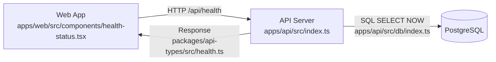
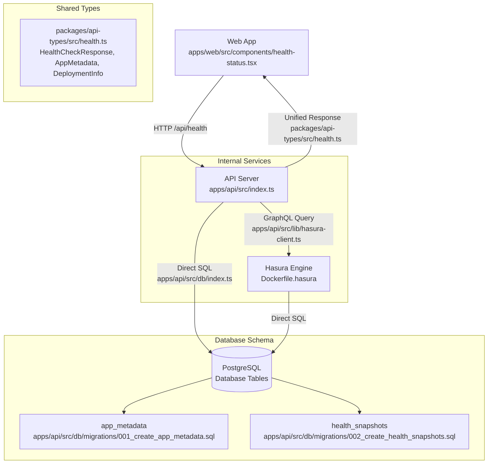

# Hasura Health Check Integration Plan <!-- omit from toc -->

- [AI Process](#ai-process)
  - [Session Continuation Prompt](#session-continuation-prompt)
- [Overview](#overview)
- [Current Architecture](#current-architecture)
- [Proposed Architecture (Option A: API Gateway Pattern)](#proposed-architecture-option-a-api-gateway-pattern)
- [File Structure \& Implementation](#file-structure--implementation)
  - [**Core Implementation Files**](#core-implementation-files)
  - [**Data Flow by File**](#data-flow-by-file)
- [Benefits of API Gateway Pattern](#benefits-of-api-gateway-pattern)
  - [Single Integration Point](#single-integration-point)
  - [Server-Side Orchestration](#server-side-orchestration)
  - [Better Security](#better-security)
- [Database Schema Changes](#database-schema-changes)
  - [New Tables](#new-tables)
- [Hasura Configuration](#hasura-configuration)
  - [Service Definition (render.yaml)](#service-definition-renderyaml)
  - [API Integration](#api-integration)
- [Implementation Tasks](#implementation-tasks)
  - [Database Setup](#database-setup)
  - [Hasura Configuration](#hasura-configuration-1)
  - [API Dependencies](#api-dependencies)
  - [Health Check Enhancement](#health-check-enhancement)
  - [Response Type Updates](#response-type-updates)
  - [Frontend Updates](#frontend-updates)
  - [Deployment Integration](#deployment-integration)
    - [Finalized Trunk-Based Development Plan](#finalized-trunk-based-development-plan)
    - [Complete render.yaml Configuration](#complete-renderyaml-configuration)
    - [Version Sync Service Updates](#version-sync-service-updates)
    - [Deployment Workflow](#deployment-workflow)
    - [Implementation Tasks](#implementation-tasks-1)
    - [Benefits of This Approach](#benefits-of-this-approach)
  - [Testing \& Validation](#testing--validation)
- [Enhanced Health Response Format](#enhanced-health-response-format)
- [Risk Mitigation](#risk-mitigation)
  - [Fallback Strategy](#fallback-strategy)
  - [Performance Considerations](#performance-considerations)
- [Success Metrics](#success-metrics)
- [Files to Create/Modify](#files-to-createmodify)
  - [New Files](#new-files)
  - [Modified Files](#modified-files)
    - [Version Tracking Strategy for Trunk-Based Development](#version-tracking-strategy-for-trunk-based-development)
    - [Database Integration with Trunk-Based Development](#database-integration-with-trunk-based-development)

## AI Process

This plan follows a structured AI-assisted development process:

0. **Review Project Setup**: Before starting any development work, review the README.md file to understand:
   - Project structure and architecture
   - Available npm/pnpm scripts (especially `pnpm validate`, `pnpm dev`, `pnpm build`)
   - Development workflow and code quality requirements
   - Environment setup and dependencies
1. **Pick Next Task**: Review the Implementation Tasks section below and select the highest priority uncompleted task
2. **Ask Clarifying Questions**: Before coding, ask the developer if any requirements or constraints need clarification
3. **Start Coding**: Implement the selected task following the specifications in this plan
4. **Validate Implementation**: Run `pnpm validate` to ensure code quality and type safety
5. **Ask Developer to Test**: Once implementation is complete, prompt the developer to test the functionality
6. **Update Task List**: After developer verification, mark the task as complete in the Implementation Tasks section
7. **Commit Changes**: Create a meaningful commit with the completed work
8. **Continue Work Prompt**: After each session, provide a prompt for continuing work in a new session that references this plan document

### Session Continuation Prompt

```
Continue implementing the Hasura Health Check Integration Plan. Please review docs/plans/hasura-health-check-integration.md and pick the next uncompleted task from the Implementation Tasks section. Follow the AI Process outlined at the top of the document.

Progress completed this session:
- ✅ Health Check Enhancement (Hasura client created, enhanced health check endpoint)
- ✅ Response Type Updates (Enhanced health response interface with version metadata)
- ✅ Frontend Updates (Version information display, styling, and response format handling)

Next uncompleted task: Deployment Integration - Create deployment script to update app_metadata table on deploy.
```

## Overview

This plan outlines the integration of Hasura GraphQL engine to enhance our existing health check system with real-time version tracking and deployment metadata. We'll implement an API Gateway pattern where the web app maintains a single integration point with our API, while the API orchestrates data from both direct database queries and Hasura GraphQL.

## Current Architecture



**Current Health Check Flow:**

1. Web app (`apps/web/src/components/health-status.tsx`) calls `/api/health` endpoint
2. API server (`apps/api/src/index.ts`) checks database connection with `SELECT NOW()` via `apps/api/src/db/index.ts`
3. Returns aggregated status using types from `packages/api-types/src/health.ts`
4. Web component displays status with 30-second polling

## Proposed Architecture (Option A: API Gateway Pattern)



**Enhanced Health Check Flow:**

1. **Frontend Layer**:

   - `apps/web/src/components/health-status.tsx` → API Server (single endpoint: `/api/health`)

2. **API Gateway Layer** (`apps/api/src/index.ts`):

   - Orchestrates multiple data sources:
     - Direct database connection tests (`apps/api/src/db/index.ts`)
     - GraphQL queries to Hasura (`apps/api/src/lib/hasura-client.ts`)
   - Combines and returns unified response using types from `packages/api-types/src/health.ts`

3. **Data Sources**:
   - **Direct PostgreSQL**: Connection testing, basic queries via `apps/api/src/db/index.ts`
   - **Hasura GraphQL**: Version metadata, historical data via `apps/api/src/lib/hasura-client.ts`
   - **Database Tables**:
     - `app_metadata` (created by `apps/api/src/db/migrations/001_create_app_metadata.sql`)
     - `health_snapshots` (created by `apps/api/src/db/migrations/002_create_health_snapshots.sql`)

## File Structure & Implementation

### **Core Implementation Files**

```
📁 Project Root
├── 📁 apps/
│   ├── 📁 api/
│   │   ├── 📄 package.json                    # Dependencies (graphql-request added)
│   │   └── 📁 src/
│   │       ├── 📄 index.ts                    # Main API server with enhanced /api/health endpoint
│   │       ├── 📁 db/
│   │       │   ├── 📄 index.ts                # Database connection + getEnhancedHealthStatus()
│   │       │   ├── 📄 seed.ts                 # Initial app_metadata seeding
│   │       │   └── 📁 migrations/
│   │       │       ├── 📄 001_create_app_metadata.sql      # Version tracking table
│   │       │       └── 📄 002_create_health_snapshots.sql  # Historical health data
│   │       └── 📁 lib/
│   │           └── 📄 hasura-client.ts        # GraphQL client + HasuraService class
│   └── 📁 web/
│       └── 📁 src/components/
│           └── 📄 health-status.tsx           # Frontend health display component
├── 📁 packages/
│   └── 📁 api-types/src/
│       └── 📄 health.ts                       # Shared TypeScript interfaces
├── 📄 Dockerfile.hasura                       # Hasura container configuration
├── 📄 render.yaml                             # Deployment configuration (Hasura service)
└── 📄 turbo.json                              # Environment variables (HASURA_*)
```

### **Data Flow by File**

1. **Request Initiation**: `apps/web/src/components/health-status.tsx`

   ```typescript
   fetch('/api/health') → API Gateway
   ```

2. **API Gateway Processing**: `apps/api/src/index.ts`

   ```typescript
   server.get("/api/health", async (): Promise<HealthCheckResponse> => {
     const enhancedStatus = await getEnhancedHealthStatus(); // From db/index.ts
     return response; // Using types from packages/api-types/src/health.ts
   });
   ```

3. **Enhanced Health Logic**: `apps/api/src/db/index.ts`

   ```typescript
   export async function getEnhancedHealthStatus() {
     const dbStatus = await checkDbConnection(); // Direct SQL
     const hasuraAvailable = await hasuraService.testConnection(); // Via hasura-client.ts
     const versions = await hasuraService.getAppMetadata(); // GraphQL query
     // Returns combined status
   }
   ```

4. **Hasura Integration**: `apps/api/src/lib/hasura-client.ts`

   ```typescript
   export class HasuraService {
     async getAppMetadata(); // Query app_metadata table
     async recordHealthSnapshot(); // Insert into health_snapshots table
     async testConnection(); // Health check Hasura itself
   }
   ```

5. **Type Safety**: `packages/api-types/src/health.ts`
   ```typescript
   export interface HealthCheckResponse {
     /* Enhanced with versions, deployment */
   }
   export interface AppMetadata {
     /* Version tracking data */
   }
   export interface DeploymentInfo {
     /* Hasura availability, environment */
   }
   ```

## Benefits of API Gateway Pattern

### Single Integration Point

- Web app only needs HTTP client (no GraphQL client)
- Consistent authentication and error handling
- Simplified client-side logic

### Server-Side Orchestration

- API can cache Hasura responses
- Combine data from multiple sources
- Handle fallbacks if Hasura is unavailable

### Better Security

- All external requests flow through API middleware
- Hasura can be internal-only (no public access)
- Centralized rate limiting and monitoring

## Database Schema Changes

### New Tables

```sql
-- Application metadata and version tracking
CREATE TABLE app_metadata (
  id SERIAL PRIMARY KEY,
  component VARCHAR(50) NOT NULL,  -- 'api', 'web', 'hasura'
  version VARCHAR(20) NOT NULL,
  deployed_at TIMESTAMP DEFAULT NOW(),
  git_commit VARCHAR(40),
  environment VARCHAR(20) DEFAULT 'production',
  metadata JSONB,  -- Additional deployment info
  UNIQUE(component, environment)
);

-- Health check snapshots for historical analysis
CREATE TABLE health_snapshots (
  id SERIAL PRIMARY KEY,
  timestamp TIMESTAMP DEFAULT NOW(),
  overall_status VARCHAR(10) NOT NULL,  -- 'up', 'down', 'degraded'
  component_statuses JSONB NOT NULL,    -- {'api': 'up', 'database': 'up', 'web': 'up'}
  response_times JSONB,                 -- {'api': 123, 'database': 45}
  errors JSONB                          -- Error details if any
);

-- Initial data
INSERT INTO app_metadata (component, version, git_commit, environment) VALUES
('api', '1.0.0', 'initial', 'production'),
('web', '1.0.0', 'initial', 'production'),
('hasura', '2.0.0', 'initial', 'production');
```

## Hasura Configuration

### Service Definition (render.yaml)

```yaml
- type: web
  name: hasura
  env: docker
  dockerfilePath: ./Dockerfile.hasura
  region: ohio
  plan: free
  port: 8080
  envVars:
    - key: HASURA_GRAPHQL_DATABASE_URL
      fromService:
        type: pserv
        name: app-postgres
        property: connectionString
    - key: HASURA_GRAPHQL_ENABLE_CONSOLE
      value: "false" # Disable public console
    - key: HASURA_GRAPHQL_ADMIN_SECRET
      sync: false
    # No unauthorized role - internal access only
```

### API Integration

```typescript
// New GraphQL client for API server
import { GraphQLClient } from "graphql-request";

const hasuraClient = new GraphQLClient(
  process.env.HASURA_URL || "http://hasura:8080/v1/graphql",
  {
    headers: {
      "x-hasura-admin-secret": process.env.HASURA_ADMIN_SECRET,
    },
  }
);

// Enhanced health check endpoint
export async function getHealthStatus() {
  // 1. Direct database check (existing)
  const dbStatus = await checkDbConnection();

  // 2. Query version metadata from Hasura
  const versionData = await hasuraClient.request(
    `
    query GetVersions($env: String!) {
      app_metadata(where: {environment: {_eq: $env}}) {
        component
        version
        deployed_at
        git_commit
      }
    }
  `,
    { env: process.env.NODE_ENV || "production" }
  );

  // 3. Optional: Record health snapshot
  await hasuraClient.request(
    `
    mutation RecordHealthSnapshot($snapshot: health_snapshots_insert_input!) {
      insert_health_snapshots_one(object: $snapshot) {
        id
      }
    }
  `,
    {
      snapshot: {
        overall_status: dbStatus.status === "up" ? "up" : "down",
        component_statuses: { database: dbStatus.status, api: "up" },
        response_times: { database: dbStatus.responseTime },
      },
    }
  );

  return {
    status: dbStatus.status,
    // ... existing fields
    versions: versionData.app_metadata,
    deployment: {
      environment: process.env.NODE_ENV,
      hasura_available: true,
    },
  };
}
```

## Implementation Tasks

### Database Setup

- [x] Create migration file `apps/api/src/db/migrations/001_create_app_metadata.sql` with app_metadata table
- [x] Create migration file `apps/api/src/db/migrations/002_create_health_snapshots.sql` with health_snapshots table
- [x] Add migration runner to `apps/api/src/db/index.ts` to execute SQL files on startup
- [x] Verify migrations create tables correctly by checking database schema

### Hasura Configuration

- [x] Create `Dockerfile.hasura` in project root with Hasura v2.0 configuration
- [x] Add hasura service definition to `render.yaml` with environment variables
- [x] Add HASURA_ADMIN_SECRET to environment configuration
- [x] Verify Hasura connects to database by accessing admin console

### API Dependencies

- [x] Add `graphql-request` package to `apps/api/package.json`
- [x] Create `apps/api/src/lib/hasura-client.ts` with GraphQL client configuration
- [x] Add environment variables for HASURA_URL and HASURA_ADMIN_SECRET to API
- [x] Verify GraphQL client connects by running a simple query

### Health Check Enhancement

- [x] Create GraphQL query for fetching app_metadata in hasura-client.ts
- [x] Create GraphQL mutation for inserting health_snapshots in hasura-client.ts
- [x] Update health check function in `apps/api/src/db/index.ts` to query Hasura for versions
- [x] Add fallback logic to health check when Hasura is unavailable
- [x] Verify enhanced health endpoint returns version metadata

### Response Type Updates

- [x] Update health response interface in `packages/api-types/src/health.ts` to include versions array
- [x] Add deployment info to health response interface
- [x] Update API health endpoint to match new response format
- [x] Verify API returns properly typed response

### Frontend Updates

- [x] Update `apps/web/src/components/health-status.tsx` to display version information
- [x] Add styling for version metadata display in health component
- [x] Update health status polling to handle new response format
- [x] Verify web app displays version information correctly

### Deployment Integration

#### Finalized Trunk-Based Development Plan

**Decision: Option A - Single render.yaml with Multiple Services**

Based on our discussion, we'll implement trunk-based development with manual production deployments using a single `render.yaml` file containing all environments.

**Environment Strategy:**

1. **Preview Environments** (feature branches) → Auto-deploy with `v1.2.3-preview.abc1234`
2. **Staging** (main branch) → Auto-deploy with `v1.2.3-staging.def5678`
3. **Production** (main branch) → Manual deploy with `v1.2.3`

#### Complete render.yaml Configuration

```yaml
# render.yaml - All environments in single file
services:
  # WEB SERVICES

  # Preview environment (feature branches)
  - type: web
    name: web-preview
    env: node
    region: ohio
    plan: free
    rootDir: .
    autoDeploy: true
    previewsEnabled: true
    buildFilter:
      paths:
        - "apps/web/**"
        - "packages/**"
        - "turbo.json"
        - "pnpm*"
    buildCommand: |
        corepack enable
        pnpm install --no-frozen-lockfile
        cd packages/api-types && pnpm build
        cd ../../apps/web && pnpm build
    startCommand: cd apps/web && PORT=10000 pnpm start
    healthCheckPath: /api/health
    port: 10000
    envVars:
      - key: NODE_ENV
        value: preview
      - key: APP_VERSION
        value: "${RENDER_GIT_TAG:-preview}-${RENDER_GIT_COMMIT:0:7}"
      - key: GIT_COMMIT
        value: "${RENDER_GIT_COMMIT}"
      - key: BUILD_TIME
        value: "${RENDER_SERVICE_DEPLOY_TIME}"
      - key: NEXT_PUBLIC_API_URL
        value: "${api-preview.url}/api"

  # Staging environment (main branch)
  - type: web
    name: web-staging
    env: node
    region: ohio
    plan: free
    rootDir: .
    branch: main
    autoDeploy: true
    buildFilter:
      paths:
        - "apps/web/**"
        - "packages/**"
        - "turbo.json"
        - "pnpm*"
    buildCommand: |
        corepack enable
        pnpm install --no-frozen-lockfile
        cd packages/api-types && pnpm build
        cd ../../apps/web && pnpm build
    startCommand: cd apps/web && PORT=10000 pnpm start
    healthCheckPath: /api/health
    port: 10000
    envVars:
      - key: NODE_ENV
        value: staging
      - key: APP_VERSION
        value: "${RENDER_GIT_TAG:-staging}-${RENDER_GIT_COMMIT:0:7}"
      - key: GIT_COMMIT
        value: "${RENDER_GIT_COMMIT}"
      - key: BUILD_TIME
        value: "${RENDER_SERVICE_DEPLOY_TIME}"
      - key: NEXT_PUBLIC_API_URL
        value: "${api-staging.url}/api"

  # Production environment (main branch, manual deploy)
  - type: web
    name: web-production
    env: node
    region: ohio
    plan: starter  # Upgrade for production
    rootDir: .
    branch: main
    autoDeploy: false  # Manual deploys only
    buildFilter:
      paths:
        - "apps/web/**"
        - "packages/**"
        - "turbo.json"
        - "pnpm*"
    buildCommand: |
        corepack enable
        pnpm install --no-frozen-lockfile
        cd packages/api-types && pnpm build
        cd ../../apps/web && pnpm build
    startCommand: cd apps/web && PORT=10000 pnpm start
    healthCheckPath: /api/health
    port: 10000
    envVars:
      - key: NODE_ENV
        value: production
      - key: APP_VERSION
        value: "${RENDER_GIT_TAG}"  # Clean semantic version
      - key: GIT_COMMIT
        value: "${RENDER_GIT_COMMIT}"
      - key: BUILD_TIME
        value: "${RENDER_SERVICE_DEPLOY_TIME}"
      - key: NEXT_PUBLIC_API_URL
        value: "${api-production.url}/api"

  # API SERVICES

  # Preview environment (feature branches)
  - type: web
    name: api-preview
    env: node
    region: ohio
    plan: free
    rootDir: .
    autoDeploy: true
    previewsEnabled: true
    buildFilter:
      paths:
        - "apps/api/**"
        - "packages/**"
        - "turbo.json"
        - "pnpm*"
    buildCommand: |
        export NODE_ENV=preview
        corepack enable
        pnpm install --no-frozen-lockfile
        cd packages/api-types && pnpm build
        cd ../../apps/api && pnpm build
    startCommand: cd apps/api && PORT=4000 pnpm start
    healthCheckPath: /api/health
    port: 4000
    envVars:
      - key: NODE_ENV
        value: preview
      - key: APP_VERSION
        value: "${RENDER_GIT_TAG:-preview}-${RENDER_GIT_COMMIT:0:7}"
      - key: GIT_COMMIT
        value: "${RENDER_GIT_COMMIT}"
      - key: BUILD_TIME
        value: "${RENDER_SERVICE_DEPLOY_TIME}"
      - key: DATABASE_URL
        fromService:
          type: pserv
          name: postgres-preview
          property: connectionString

  # Staging environment (main branch)
  - type: web
    name: api-staging
    env: node
    region: ohio
    plan: free
    rootDir: .
    branch: main
    autoDeploy: true
    buildFilter:
      paths:
        - "apps/api/**"
        - "packages/**"
        - "turbo.json"
        - "pnpm*"
    buildCommand: |
        export NODE_ENV=staging
        corepack enable
        pnpm install --no-frozen-lockfile
        cd packages/api-types && pnpm build
        cd ../../apps/api && pnpm build
    startCommand: cd apps/api && PORT=4000 pnpm start
    healthCheckPath: /api/health
    port: 4000
    envVars:
      - key: NODE_ENV
        value: staging
      - key: APP_VERSION
        value: "${RENDER_GIT_TAG:-staging}-${RENDER_GIT_COMMIT:0:7}"
      - key: GIT_COMMIT
        value: "${RENDER_GIT_COMMIT}"
      - key: BUILD_TIME
        value: "${RENDER_SERVICE_DEPLOY_TIME}"
      - key: DATABASE_URL
        fromService:
          type: pserv
          name: postgres-staging
          property: connectionString

  # Production environment (main branch, manual deploy)
  - type: web
    name: api-production
    env: node
    region: ohio
    plan: starter  # Upgrade for production
    rootDir: .
    branch: main
    autoDeploy: false  # Manual deploys only
    buildFilter:
      paths:
        - "apps/api/**"
        - "packages/**"
        - "turbo.json"
        - "pnpm*"
    buildCommand: |
        export NODE_ENV=production
        corepack enable
        pnpm install --no-frozen-lockfile
        cd packages/api-types && pnpm build
        cd ../../apps/api && pnpm build
    startCommand: cd apps/api && PORT=4000 pnpm start
    healthCheckPath: /api/health
    port: 4000
    envVars:
      - key: NODE_ENV
        value: production
      - key: APP_VERSION
        value: "${RENDER_GIT_TAG}"  # Clean semantic version
      - key: GIT_COMMIT
        value: "${RENDER_GIT_COMMIT}"
      - key: BUILD_TIME
        value: "${RENDER_SERVICE_DEPLOY_TIME}"
      - key: DATABASE_URL
        fromService:
          type: pserv
          name: postgres-production
          property: connectionString

  # HASURA SERVICES

  # Preview environment
  - type: web
    name: hasura-preview
    env: docker
    dockerfilePath: ./Dockerfile.hasura
    region: ohio
    plan: free
    port: 8080
    autoDeploy: true
    previewsEnabled: true
    envVars:
      - key: HASURA_GRAPHQL_DATABASE_URL
        fromService:
          type: pserv
          name: postgres-preview
          property: connectionString
      - key: HASURA_GRAPHQL_ENABLE_CONSOLE
        value: "true"  # Enabled for preview
      - key: HASURA_GRAPHQL_DEV_MODE
        value: "true"
      - key: HASURA_GRAPHQL_ADMIN_SECRET
        sync: false

  # Staging environment
  - type: web
    name: hasura-staging
    env: docker
    dockerfilePath: ./Dockerfile.hasura
    region: ohio
    plan: free
    port: 8080
    branch: main
    autoDeploy: true
    envVars:
      - key: HASURA_GRAPHQL_DATABASE_URL
        fromService:
          type: pserv
          name: postgres-staging
          property: connectionString
      - key: HASURA_GRAPHQL_ENABLE_CONSOLE
        value: "false"
      - key: HASURA_GRAPHQL_DEV_MODE
        value: "false"
      - key: HASURA_GRAPHQL_ADMIN_SECRET
        sync: false

  # Production environment
  - type: web
    name: hasura-production
    env: docker
    dockerfilePath: ./Dockerfile.hasura
    region: ohio
    plan: starter  # Upgrade for production
    port: 8080
    branch: main
    autoDeploy: false  # Manual deploys only
    envVars:
      - key: HASURA_GRAPHQL_DATABASE_URL
        fromService:
          type: pserv
          name: postgres-production
          property: connectionString
      - key: HASURA_GRAPHQL_ENABLE_CONSOLE
        value: "false"
      - key: HASURA_GRAPHQL_DEV_MODE
        value: "false"
      - key: HASURA_GRAPHQL_ADMIN_SECRET
        sync: false

# DATABASES - Separate per environment
- type: pserv
  name: postgres-preview
  env: postgres
  plan: free
  region: ohio
  ipAllowList: []
  disk:
    name: preview-data
    mountPath: /var/lib/postgresql/data
    sizeGB: 10

- type: pserv
  name: postgres-staging
  env: postgres
  plan: free
  region: ohio
  ipAllowList: []
  disk:
    name: staging-data
    mountPath: /var/lib/postgresql/data
    sizeGB: 10

- type: pserv
  name: postgres-production
  env: postgres
  plan: starter  # Upgrade for production
  region: ohio
  ipAllowList: []
  disk:
    name: production-data
    mountPath: /var/lib/postgresql/data
    sizeGB: 20
```

#### Version Sync Service Updates

**Updated getVersionString() method:**

```typescript
private getVersionString(): string {
  const environment = process.env.NODE_ENV || "development";
  const commit = this.getGitCommit().substring(0, 7);

  // Production: Use clean semantic version from environment or git tag
  if (environment === "production") {
    return process.env.APP_VERSION || this.getLatestGitTag() || packageJson.version;
  }

  // Staging: Add staging suffix with commit
  if (environment === "staging") {
    const baseVersion = this.getLatestGitTag() || packageJson.version;
    return `${baseVersion}-staging.${commit}`;
  }

  // Preview/Development: Add preview suffix with commit
  const baseVersion = this.getLatestGitTag() || packageJson.version;
  return `${baseVersion}-preview.${commit}`;
}

private getLatestGitTag(): string | null {
  try {
    return execSync("git describe --tags --abbrev=0", {
      encoding: "utf8",
      timeout: 1000,
      stdio: ["ignore", "pipe", "ignore"],
    }).trim();
  } catch (error) {
    return null;
  }
}
```

#### Deployment Workflow

**1. Feature Development:**

- Create feature branch from main
- Push commits → Preview environment auto-deploys
- Version format: `v1.2.3-preview.abc1234`

**2. Staging Deployment:**

- Merge feature branch to main
- Staging environment auto-deploys
- Version format: `v1.2.3-staging.def5678`
- Test and validate in staging

**3. Production Release:**

- Create git tag: `git tag v1.2.4`
- Push tag: `git push origin v1.2.4`
- Manually trigger production deploy via Render dashboard or deploy hook
- Version format: `v1.2.4` (clean semantic version)

#### Implementation Tasks

- [x] Create `VersionSyncService` class with startup sync functionality
- [x] Implement smart environment variable handling with fallbacks
- [x] Add git command execution for development environment
- [x] Update `render.yaml` with version environment variables
- [x] Integrate version sync into API startup process
- [ ] **Update version sync service for trunk-based development** (environment-aware version formatting)
- [ ] **Replace current render.yaml with complete multi-environment configuration**
- [ ] **Test preview environment deployment** (feature branch auto-deploy)
- [ ] **Test staging environment deployment** (main branch auto-deploy)
- [ ] **Set up production deploy hooks** (manual deployment process)
- [ ] **Implement proper version recording to app_metadata table** (currently using health snapshot placeholder)
- [ ] **End-to-end testing** of the complete workflow

#### Benefits of This Approach

**✅ Advantages:**

- Single source of truth for all environment configurations
- Clear separation between auto-deploy (preview/staging) and manual (production)
- Environment-specific version tracking with commit traceability
- Separate databases per environment (no data contamination)
- Scalable to additional environments if needed

**⚠️ Considerations:**

- Production rebuilds from source (no build artifact promotion)
- Manual coordination required for production releases
- Larger render.yaml file to maintain
- Multiple database costs (though free tier available)

This approach achieves both strategic goals:

- **Architecture Development**: Showcases Hasura CRUD capabilities across environments
- **Operational Benefits**: Provides comprehensive deployment tracking and CI/CD stability metrics

### Testing & Validation

- [ ] Create integration test for health endpoint with Hasura data
- [ ] Test health endpoint behavior when Hasura is down (fallback mode)
- [ ] Verify health check response time stays under 800ms with Hasura
- [ ] Test end-to-end flow: deploy → version update → health check → frontend display

## Enhanced Health Response Format

```typescript
interface EnhancedHealthResponse {
  status: "up" | "down";
  timestamp: string;
  uptime: number;
  environment: string;

  // Enhanced version information
  versions: {
    component: string;
    version: string;
    deployed_at: string;
    git_commit?: string;
  }[];

  // Existing details
  details: {
    uptime: HealthIndicatorStatus;
    memory_heap: HealthIndicatorStatus;
    disk: HealthIndicatorStatus;
    database: HealthIndicatorStatus;
    hasura?: HealthIndicatorStatus; // New
  };

  // New deployment info
  deployment: {
    environment: string;
    hasura_available: boolean;
    last_deployed?: string;
  };
}
```

## Risk Mitigation

### Fallback Strategy

- Health checks work even if Hasura is down
- Graceful degradation: basic health without version metadata
- Existing REST endpoints remain unchanged

### Performance Considerations

- Cache Hasura responses in API layer
- Async health snapshot recording (non-blocking)
- Connection pooling for GraphQL client

## Success Metrics

1. **Functional**: Enhanced health endpoint returns version metadata
2. **Performance**: Health check response time < 800ms (including Hasura)
3. **Reliability**: Health checks work even when Hasura is unavailable
4. **Deployment**: Version metadata updated within 30 seconds of deployment

## Files to Create/Modify

### New Files

- `Dockerfile.hasura`
- `apps/api/src/db/migrations/001_add_metadata_tables.sql`
- `apps/api/src/lib/hasura-client.ts`

### Modified Files

- `render.yaml` (add Hasura service)
- `apps/api/src/index.ts` (integrate GraphQL client)
- `apps/api/src/db/index.ts` (enhanced health check)
- `packages/api-types/src/health.ts` (extend response types)
- `apps/web/src/components/health-status.tsx` (display version info)

#### Version Tracking Strategy for Trunk-Based Development

**Environment Flow:**

1. **Preview Environments** (feature branches) → `v1.2.3-preview.abc1234`
2. **Staging** (main branch) → `v1.2.3-staging.def5678`
3. **Production** (manual promotion) → `v1.2.3`

**Version Format Strategy:**

```typescript
private getVersionString(): string {
  const environment = process.env.NODE_ENV || "development";
  const commit = this.getGitCommit().substring(0, 7);

  // Production: Use clean semantic version from environment or git tag
  if (environment === "production") {
    return process.env.APP_VERSION || this.getLatestGitTag() || `${packageJson.version}`;
  }

  // Staging: Add staging suffix with commit
  if (environment === "staging") {
    const baseVersion = this.getLatestGitTag() || packageJson.version;
    return `${baseVersion}-staging.${commit}`;
  }

  // Preview/Development: Add preview suffix with commit
  const baseVersion = this.getLatestGitTag() || packageJson.version;
  return `${baseVersion}-preview.${commit}`;
}

private getLatestGitTag(): string {
  try {
    return execSync("git describe --tags --abbrev=0", {
      encoding: "utf8",
      timeout: 1000,
      stdio: ["ignore", "pipe", "ignore"],
    }).trim();
  } catch (error) {
    return null;
  }
}
```

**Render Configuration for Trunk-Based Development:**

```yaml
# Option 1: Single render.yaml with all environments
services:
  # Preview environments
  - type: web
    name: api-preview
    autoDeploy: true
    previewsEnabled: true
    envVars:
      - key: NODE_ENV
        value: preview
      - key: APP_VERSION
        value: "${RENDER_GIT_TAG:-preview}-${RENDER_GIT_COMMIT:0:7}"

  # Staging environment
  - type: web
    name: api-staging
    branch: main
    autoDeploy: true
    envVars:
      - key: NODE_ENV
        value: staging
      - key: APP_VERSION
        value: "${RENDER_GIT_TAG:-staging}-${RENDER_GIT_COMMIT:0:7}"

  # Production environment
  - type: web
    name: api-production
    branch: main
    autoDeploy: false # Manual deploys only
    envVars:
      - key: NODE_ENV
        value: production
      - key: APP_VERSION
        value: "${RENDER_GIT_TAG}" # Clean semantic version
```

**Deployment Workflow:**

1. **Feature Development** → Preview environment auto-deploys with `v1.2.3-preview.abc1234`
2. **Merge to Main** → Staging auto-deploys with `v1.2.3-staging.def5678`
3. **Production Release** → Manual deploy (via deploy hook) with `v1.2.3`

**Version Uniqueness:**

- Each environment gets unique version identifiers
- Production uses clean semantic versions
- Staging/Preview include commit hashes for traceability
- Database tracks deployment history per environment

#### Database Integration with Trunk-Based Development

**Existing Schema Perfectly Supports Trunk-Based Flow:**

Our current `app_metadata` table schema is ideally designed for this workflow:

```sql
CREATE TABLE IF NOT EXISTS "app_metadata" (
  "id" serial PRIMARY KEY NOT NULL,
  "component" varchar(50) NOT NULL,           -- 'api', 'web', 'hasura'
  "version" varchar(20) NOT NULL,             -- Environment-specific version
  "deployed_at" timestamp DEFAULT now(),      -- Deployment timestamp
  "git_commit" varchar(40),                   -- Actual commit hash
  "environment" varchar(20) DEFAULT 'production', -- 'preview', 'staging', 'production'
  "metadata" jsonb,                           -- Branch/tag info
  CONSTRAINT "app_metadata_component_environment_unique" UNIQUE("component","environment")
);
```

**Data Examples for Each Environment:**

```sql
-- Preview Environment (feature branch: feature/user-auth)
INSERT INTO app_metadata (component, version, git_commit, environment, metadata) VALUES
('api', 'v1.2.3-preview.abc1234', 'abc1234567890abcdef...', 'preview',
 '{"branch": "feature/user-auth", "pr_number": 42}');

-- Staging Environment (main branch)
INSERT INTO app_metadata (component, version, git_commit, environment, metadata) VALUES
('api', 'v1.2.3-staging.def5678', 'def5678901234567890...', 'staging',
 '{"branch": "main", "auto_deployed": true}');

-- Production Environment (tagged release)
INSERT INTO app_metadata (component, version, git_commit, environment, metadata) VALUES
('api', 'v1.2.3', 'def5678901234567890...', 'production',
 '{"tag": "v1.2.3", "manual_deploy": true}');
```

**Version Sync Service Query Strategy:**

```typescript
// Environment-aware version checking
private async getLatestDbVersion(component: string): Promise<DbVersionInfo | null> {
  const environment = process.env.NODE_ENV || "development";

  // Query for this specific component + environment combination
  const versions = await hasuraService.getAppMetadata(environment);
  const componentVersion = versions.find(v => v.component === component);

  return componentVersion || null;
}

// Version comparison logic
private shouldUpdateVersion(current: VersionInfo, latest: DbVersionInfo | null): boolean {
  if (!latest) return true; // No version in DB for this environment

  // Update if version string OR git commit changed
  return (
    current.version !== latest.version ||
    current.git_commit !== latest.git_commit
  );
}
```

**Health Check Response Per Environment:**

```typescript
// Preview environment health check response
{
  "status": "up",
  "environment": "preview",
  "versions": [
    {
      "component": "api",
      "version": "v1.2.3-preview.abc1234",
      "deployed_at": "2024-01-15T10:00:00Z",
      "git_commit": "abc1234"
    }
  ],
  "deployment": {
    "environment": "preview",
    "hasura_available": true,
    "branch": "feature/user-auth"
  }
}

// Production environment health check response
{
  "status": "up",
  "environment": "production",
  "versions": [
    {
      "component": "api",
      "version": "v1.2.3",
      "deployed_at": "2024-01-15T16:00:00Z",
      "git_commit": "def5678"
    }
  ],
  "deployment": {
    "environment": "production",
    "hasura_available": true,
    "tag": "v1.2.3"
  }
}
```

**Benefits of This Database Design:**

✅ **Environment Isolation**: Each environment maintains separate version history  
✅ **Component Tracking**: Track API, web, and Hasura versions independently  
✅ **Version History**: Unique constraint ensures latest version per environment  
✅ **Git Traceability**: Full commit hash stored for debugging  
✅ **Metadata Flexibility**: JSONB field for branch/tag/PR information  
✅ **Query Efficiency**: Simple queries by environment + component
